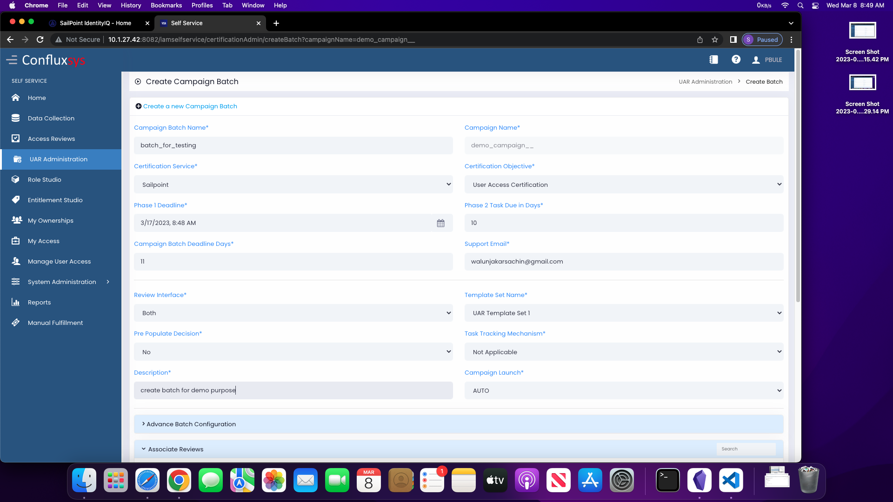

### DSP flow has 5 Stages
1. create campaign
2. create batch  (pass following parameters)

4. import review (while creating batch)
5. view generation (using sailpoint: run task "DSP 9-1 View Generation")

#### Importing review
1. creating review
	1. create certificate
		1. Sailpoint > setup > certifications
		4. right click on certificate to be use as template
		5. select "use as template"
		6. (schedule) run now
		7. save & execute
	2. getting review Id
		1. go to created certificate
		2. click on "`[View/Edit Certification Options]`"
		3. from url copy value of "certificationGroupId"
2. import review
	1. Sailpoint > task
	2. select task "DSP 9-1 Manual Review Import"
	3. paste review Id
	4. run "Save & Execute"
	5. we can see imported reiews under "self service > UAR Administration > Manage Reviews"
	6. add review to batch 
		1. create batch > associate reviews > copy paste review name
		2. add reviews to "reviews selected" 
		3. add all reviews from "review selected" to "Associated Reviews"
 

#### View Generation
1. from self service run the batch 
2. sailpoint > task
3. select "DSP 9-1 View Generation"
4. pass "campaign & batch name"
5. run "Save and Execute"    
    
>In view generation, batch status will change from "Created" to "In Progress"

